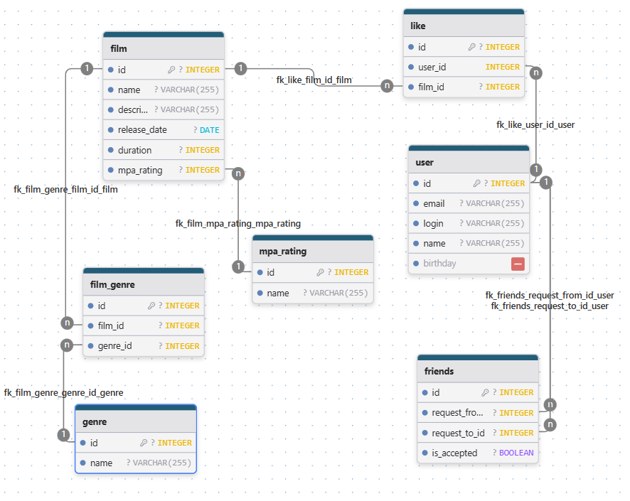

# java-filmorate
Template repository for Filmorate project.

ER-диаграмма базы данных проекта Filmorate


Примеры SQL запросов:

- Получение всех фильмов. Даёт информацию о фильмах, включая жанры и количество лайков.
```sql
SELECT 
    f.id,
    f.name,
    f.description,
    f.release_date,
    f.duration,
    m.name AS mpa_rating_name,
    COUNT(l.id) AS likes_count,
    STRING_AGG(g.name, ', ') AS genres
FROM film f
LEFT JOIN mpa_rating m ON f.mpa_rating = m.id
LEFT JOIN "like" l ON f.id = l.film_id
LEFT JOIN film_genre fg ON f.id = fg.film_id
LEFT JOIN genre g ON fg.genre_id = g.id
GROUP BY f.id, f.name, f.description, f.release_date, f.duration, m.name;
```
- Получение всех пользователей. Показывает пользователей и количество подтверждённых друзей.
```sql
SELECT 
    u.*,
    (
        SELECT COUNT(*)
        FROM friends f
        WHERE (f.request_from_id = u.id OR f.request_to_id = u.id)
          AND f.is_accepted = TRUE
    ) AS friends_count
FROM "user" u;
```
- Топ N наиболее популярных фильмов
```sql
SELECT 
    f.id,
    f.name,
    COUNT(l.id) AS likes_count
FROM film f
LEFT JOIN "like" l ON f.id = l.film_id
GROUP BY f.id, f.name
ORDER BY likes_count DESC
LIMIT N;  -- например, 10
```
- Список ID общих друзей двух пользователей
```sql
SELECT DISTINCT friend_id
FROM (
    SELECT 
        CASE 
            WHEN request_from_id = A THEN request_to_id 
            ELSE request_from_id 
        END AS friend_id
    FROM friends 
    WHERE (request_from_id = A OR request_to_id = A) 
      AND is_accepted = TRUE
) AS friends_of_A
WHERE friend_id IN (
    SELECT 
        CASE 
            WHEN request_from_id = B THEN request_to_id 
            ELSE request_from_id 
        END AS friend_id
    FROM friends 
    WHERE (request_from_id = B OR request_to_id = B) 
      AND is_accepted = TRUE
);
```